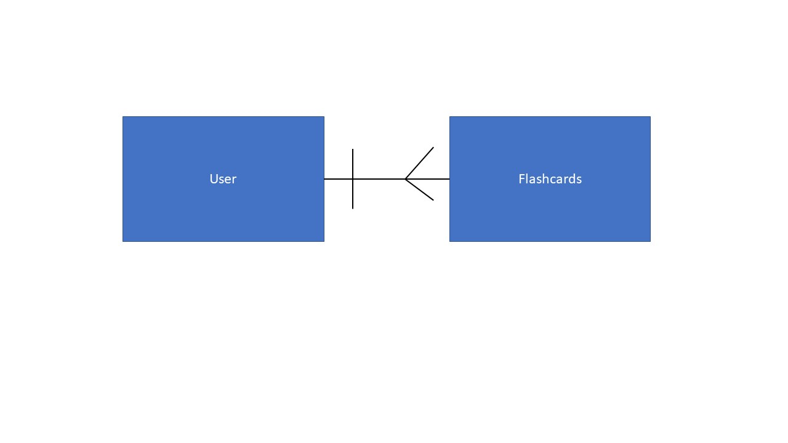

# Russian Flashcards Web API: Description

This application is a web API server built upon Express.JS, Mongoose.js,
and Node.js. It also uses the bcrypt and Passport.js node modules for
encryption and authentication. It provides web services for the Russian
Flashcards app built while attending the General Assembly SEI.

I initially had more ambitious ideas. This was going to
In the initial first version, duplicate flashcards could be generated
since the requirements state that users must own flashcards. If two
different users create a flashcard for the word "car", then obviously
that flashcard would be duplicated in the database. 

The first version of this app tries to be bilingual, but it is slightly
biased toward native English speakers. It uses a Cyrillic soft keyboard
for the mangement of flashcards, but that same keyboard is not used 
for the sign-up, sign-in, and change password pages.

## Planning Story

My initial work was to read and understand the project requirements.

My initial idea was more ambitious than this project came to be. I wanted to 
create a Russian dictionary web API. Since Russian is such a highly inflected
language, one could retrieve noun declensions, verb conjugations, etc.
But the wrinkle was that each user must own something in the database. Since owners
do not own dictionaries, I had to toss that idea. But owners can create and use flashcards.
So the project became much smaller in scope.

Once I accepted that idea, there was not much planning for this API. I completed the
backend in less than a day. I pretty much followed the pattern that we learned at
General Assembly. I was able to reuse cURL scripts from my tic-tac-toe project and 
just tweak them.

The only customization that I made was to create the http-status-codes.js file
that exists in the lib folder. I am not a fan of magic numbers and strings, so
this file simply uses a JavaScript object literal to build what would be an
enumeration in languages such as C#. This allows the user to employ an enumeration
since JavaScript does not natively support enumerations. Now the code becomes 
more readable then simply returning a status of "404".

I also wanted to write Jest unit and intergration tests for this project, but I wanted
to meet the basic project requirements before I tackled something so ambtious. I feel
naked without tests.

***

### User Stories

I am not sure whether user stories really apply to a web API, so for the sake
of completeness I shall duplicate them here.

* As a User I want to sign up so that I may review Russian flashcards.
* As a User I want to sign in once I have created an account so that I may review Russian flashcards.
* As a signed in User I want to change my password so that I can ensure that my account is secure.
* As a signed in User I want to sign out from the app so that my session is closed.
* As a signed in User I want to review a Russian flashcard.
* As a signed in User I want to create a Russian flashcard.
* As a signed in User I want to update a Russian flashcard.
* As a signed in User I want to delete a Russian flashcard.

***

### Technologies Directly Used

* Express.js
* Mongoose.js
* Node.js
* bcryot
* Passport.js

***

### Unsolved Problems

* I have no usolved problems based upon the requirements given to me.

***

### Nice-to-haves / Technical Debt

* Rewrite the provided and custom code in order to elminate magic numbers and strings. 
- Search for code duplication and eliminate it.
* Write unit and integration tests with Jest.
***

#### ERD Diagram:

